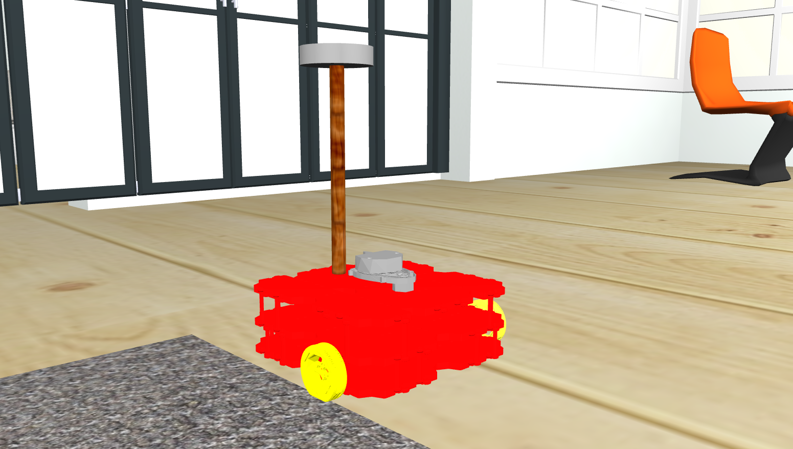
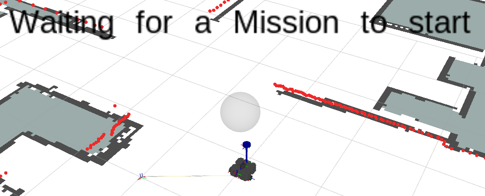

<!-- Improved compatibility of back to top link: See: https://github.com/othneildrew/Best-README-Template/pull/73 -->
<a name="readme-top"></a>
<!--
*** Thanks for checking out the Best-README-Template. If you have a suggestion
*** that would make this better, please fork the repo and create a pull request
*** or simply open an issue with the tag "enhancement".
*** Don't forget to give the project a star!
*** Thanks again! Now go create something AMAZING! :D
-->


<!-- PROJECT SHIELDS -->
<!--
*** I'm using markdown "reference style" links for readability.
*** Reference links are enclosed in brackets [ ] instead of parentheses ( ).
*** See the bottom of this document for the declaration of the reference variables
*** for contributors-url, forks-url, etc. This is an optional, concise syntax you may use.
*** https://www.markdownguide.org/basic-syntax/#reference-style-links
-->
<div align="center">

[![Contributors][contributors-shield]][contributors-url]


<!-- PROJECT LOGO -->
<br />

  <a href="https://github.com/mestrinio/PSR_Trabalho3/graphs/">
    
  </a>

<h3 align="center">PSR - Trabalho Prático 3</h3>
<h3 align="center">THOR - Trully Hardworking Outstanding Robot</h3>

<h2><b> Repository Owner: Pedro Martins 103800
<br>Collaborators: Luís Fernandes 103085 & Afonso Pereira 89142 </b></h2>

  <p align="center">
    This repository was created for evaluation @ Robotic Systems Programming "PSR 23-24 Trabalho prático 3".
    <br />
    <!-- <a href="https://github.com/mestrinio/PSR_Trabalho3"><strong>Explore the Wiki »</strong></a> -->
    <br >
    <a href="https://github.com/mestrinio/PSR_Trabalho3/issues"> <u>Make Suggestion</u> </a>
  </p>
</div>
<br>


<!-- TABLE OF CONTENTS -->
<details>
  <summary>Table of Contents</summary>
  <ol>
    <li>
      <a href="#about-the-assignment">About the assignment</a>
    </li>
     <li>
      <a href="#Objectives">Objectives</a>
    </li>
    <li>
      <a href="#getting-started">Getting Started</a>
      <ul>
        <li><a href="#Setup">Setup</a></li>
      </ul>
    </li>
    <li><a href="#usage">Usage</a></li>
    <li><a href="#contact">Contact</a></li>
    <li><a href="#acknowledgments">Acknowledgments</a></li>
  </ol>
</details>
<br>


<!-- ABOUT THE ASSIGNMENT -->
## About the Assignment
<div align="center">

</div>
<br>
This assignment was developed for Robotic Systems Programming. It uses a simulated environment to program a simulated robot, model TurtleBot3. The bot is meant to be accomplish a certain number of missions, including detection of objects or people, using image similarity or database comparison (with YOLOv8), and other navigation and localization missions. The model has been modified to have similarities with the "Thor" god character. The program uses ROS and its programmed with Python language and OpenCV library.

<p align="right">(<a href="#readme-top">back to top</a>)</p>


<!-- ### Built With

* [![Next][Next.js]][Next-url]
* [![React][React.js]][React-url]
* [![Vue][Vue.js]][Vue-url]
* [![Angular][Angular.io]][Angular-url]
* [![Svelte][Svelte.dev]][Svelte-url]
* [![Laravel][Laravel.com]][Laravel-url]
* [![Bootstrap][Bootstrap.com]][Bootstrap-url]
* [![JQuery][JQuery.com]][JQuery-url]

<p align="right">(<a href="#readme-top">back to top</a>)</p> -->


<!-- Objectives -->
## Objectives/Missions
### Robot configuration (Objective)

The robot model is based on Turtlebot3 Waffle Pi but has been customized to fit the Thor theme. Colors and 3D features have been altered and included to match Thor's outfit style, and his hammer. An extra camera has been added to the top of the model.

<br>

### Scenery Mapping (Objective)

A previous mapping of the simulated house has been done using the procedure taught in class.................

<br>

### Robot navigation (Mission)

This robot features 4 different navigation modules:
- Teleop driving (incrementation of velocity values, linear and angular)
- Teleop videogame driving (WASD controls the instantaneous velocities)
- Autonomous point-to-point at specific location selected in RViz
- Autonomous point-to-point at specific room selected in mission manager.

<br>

### Object spawning in scenery (Objective)

It is possible to spawn different objects in different positions using a specific script.

<br>

### Object Detection (Missions)

THOR has it's own object detection features, which include usage of color and shape to detect objects using it's cameras.

#### Specific Missions

A more detailed view of the missions and features is explained later on this guide.


<!-- GETTING STARTED -->
## Getting Started

To use THOR, you need to have ROS properly installed on your system (<a href="http://wiki.ros.org/ROS/Installation"> <u>ROS Installation</u> </a>). Furthermore, you must have turtlebot3 original model associated (<a href="https://www.turtlebot.com/turtlebot3/"> <u>Turtlebot3 Models</u> </a>). Lastly, the house needs to be downloaded to the previously made catkin_ws/src directory (```git clone https://github.com/aws-robotics/aws-robomaker-small-house-world```) and some other packages must be installed on python for everything to work.
IMPORTANT NOTE: YOLOv8 from ultralytics occupies a lot of storage so be sure to have at least 20 GB free to use.

## Setup
<h3><b>Installs</b></h3>

```
sudo apt-get install ros-noetic-map-server
sudo apt-get install ros-noetic-amcl
sudo apt-get install ros-noetic-navigation
sudo apt-get install ros-<your-ros-distro>-cv-bridge
sudo apt-get install ros-<your-ros-distro>-image-transport
sudo apt install python3 python3-tk
pip install numpy
pip install ultralytics
pip install gTTS
pip install playsound
pip install opencv-python
```

<p align="right">(<a href="#readme-top">back to top</a>)</p>

<!-- USAGE EXAMPLES -->
## Usage

### Launch simulation (Follow order)

```
roslaunch robutler_bringup_tp3 gazebo.launch
roslaunch robutler_bringup_tp3 bringup.launch
rosrun robutler_bringup_tp3 mission_manager_menu
```

Navigation (choose one):
```
rosrun robutler_bringup_tp3 teleop_key
rosrun robutler_bringup_tp3 teleop_keypressteste
```

##### Keybindings:
- 'W' to move forwards
- 'S' to move backwards
- 'D' to turn right
- 'A' to turn left 

<br>
Other navigations:

- Using RViz select option to move to 2d point.
- Right press the balloon over THOR (as seen in the picture bellow) to open missions menu, and select option to move to desired room.

  <a href="https://github.com/mestrinio/PSR_Trabalho3/graphs/">
  <div align="center">
    
  </a>
***

<br>

### Object Spawn

The user is able to spawn various predefined objects in various spots in the house by using the following structure "rosrun robutler_bringup_tp3 spawn_object.py [-l LOCATION] [-o OBJECT]. The command would look something like:
```
rosrun robutler_bringup_tp3 spawn_object.py -l on_bed -o sphere_v
```
Bellow you can find two lists, containing both the code and respective name of all the usable objects and locations.
<details>
  <summary>List of spawnable objects</summary>

  - sphere_v (Violet Sphere);
  - sphere_r (Red Sphere);
  - sphere_g (Green Sphere);
  - sphere_org (Orange Sphere);
  - sphere_Y (Yellow Sphere);
  - sphere_b (Blue Sphere);
  - cube_r (Red Cube);
  - cube_b (Blue Cube);
  - person_standing (Person Standing up);
  - laptop (Open Laptop);
  - can_coke (Can of Coke);
</details>

<br>

<details>
  <summary>List of spawnable locations</summary>

- on_bed (on the bed);
- on_bed_side_table (on the bed side table);
- on_bedroom_table (on the bedroom table);
- on_kitchen (on the kitchen floor);
- on_living_room (on the living room floor);
- on_playground (on the playground floor);
- on_living_room_table (on the living room table);
- on_living_room_table2 (another spot on the living room table);
</details>

<br>

### Detection

By analising the images captured by it's cameras, THOR is able to detect a plethora of things. By selecting "Search for object in division" in the mission menu, the user will be able to choose an object for THOR to find in a given division. The object can be balls and cubes of various colors, a coke can and even a laptop. It will also count how many objects of the specified type were found in it's search!

THOR's detection module is also equiped to handle more advanced missions, such as checking if the table is clean, which will check if there are any objects on the table, or if someone is home, which will take him around the house searching for a Human being.

<br>

### Specific Missions

Have you ever wanted to see how your roomba would act if you left it charging for a whole month? Well, THOR will allow you to satisfy this desire, while also providing a first view! By selecting the mission "F1 Mode?", THOR will start racing around the room as if it's life depended on it!


***
<br>

<!-- CONTACT -->
## Contact
Luís Fernandes - luis.c.fernandes8@ua.pt


Nuno Afonso Pereira - nafonsofp@ua.pt


Pedro Martins - pedro.mestre@ua.pt


Project Link: [Trabalho Prático 3](https://github.com/mestrinio/PSR_Trabalho3)

<p align="right">(<a href="#readme-top">back to top</a>)</p>


<!-- ACKNOWLEDGMENTS -->
## Acknowledgments

* Professor Miguel Oliveira - mriem@ua.pt

<p align="right">(<a href="#readme-top">back to top</a>)</p>


<!-- MARKDOWN LINKS & IMAGES -->
<!-- https://www.markdownguide.org/basic-syntax/#reference-style-links -->
[contributors-shield]: https://img.shields.io/github/contributors/RobutlerAlberto/RobutlerAlberto.svg?style=for-the-badge
[contributors-url]: https://github.com/mestrinio/PSR_Trabalho3/graphs/contributors
[product-screenshot]: docs/logo.png
